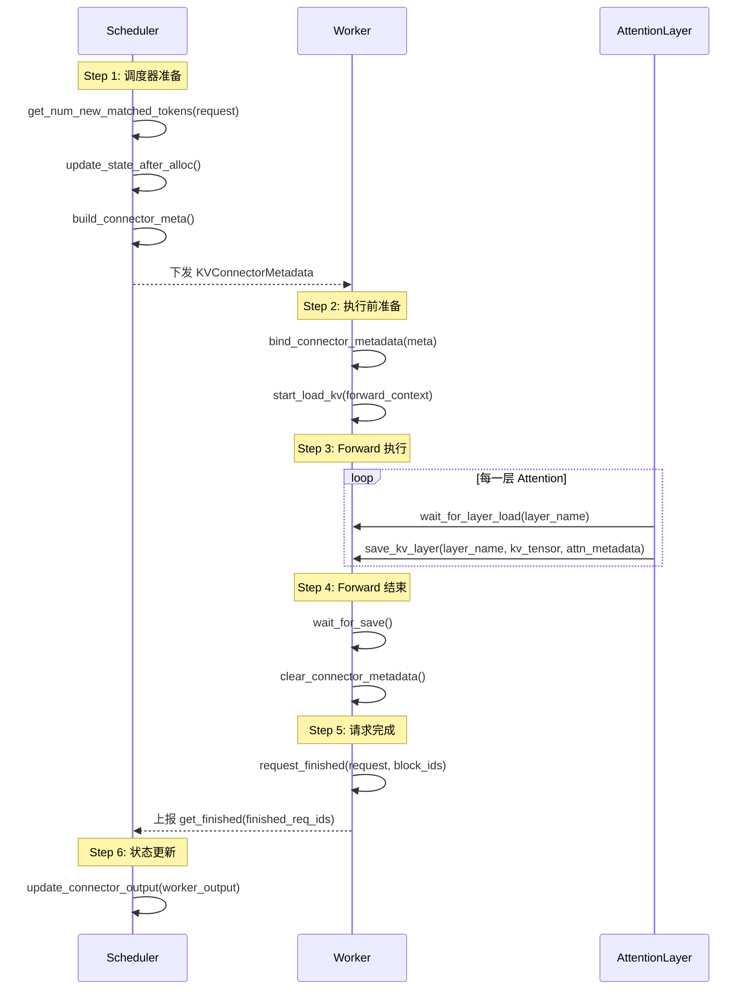

# 关于nixl的提交记录/PD集成nvidia nixl
https://github.com/vllm-project/vllm/pull/17751

[P/D] NIXL Integration (#17751) d19110204c03e9b77ed957fc70c1262ff370f5e2


# 抽象基类 KVConnectorBase_V1
很好 👍，你贴的这一段就是 **vLLM 中 KVConnector 的抽象基类接口定义**。
我帮你逐段解释它的设计思路和各个函数的作用。

---

## 🏗 整体作用

`KVConnectorBase_V1` 作为 **KV 缓存传输的抽象基类**，分为 **两侧接口**：

* **Worker-side（模型执行节点）**
  负责和模型执行强相关的事情：KV cache 的加载、保存、异步传输、等待完成等。
* **Scheduler-side（调度器节点）**
  负责和调度逻辑相关的事情：决定哪些 KV 可以重用、生成 metadata，维护 KV 状态。

这样就把 **模型推理执行** 和 **分布式调度** 解耦。

---

## 代码解析

### 1. 初始化

```python
def __init__(self, vllm_config: "VllmConfig", role: KVConnectorRole):
    logger.warning("... API is experimental ...")
    self._connector_metadata: Optional[KVConnectorMetadata] = None
    self._vllm_config = vllm_config
    self._role = role
```

* `vllm_config`：vLLM 的全局配置（batching, kv layout 等）
* `role`：表明是 **worker 端** 还是 **scheduler 端**
* `_connector_metadata`：存放每次调度时的 **KV 传输计划**（scheduler 构建 → worker 使用）

---

### 2. Worker 端接口

#### 绑定/清理 metadata

```python
def bind_connector_metadata(self, connector_metadata: KVConnectorMetadata): ...
def clear_connector_metadata(self): ...
def _get_connector_metadata(self) -> KVConnectorMetadata: ...
```

* 在每次模型执行前，scheduler 会生成 metadata，然后下发到 worker。
* worker 执行完一次 forward，就要清理。
* `_get_connector_metadata` 只允许 connector 内部调用，保证安全。

#### KV cache 注册和 host buffer 支持

```python
def register_kv_caches(self, kv_caches: dict[str, torch.Tensor]): ...
def set_host_xfer_buffer_ops(self, copy_operation: CopyBlocksOp): ...
```

* `register_kv_caches`：预注册 KV 缓存，像 **NIXLConnector** 这种需要预分配 KV 缓冲时用。
* `set_host_xfer_buffer_ops`：如果要经过 **host buffer 中转**（比如 GPU↔CPU↔RDMA），这里注册拷贝函数。

#### 关键抽象接口

```python
@abstractmethod
def start_load_kv(self, forward_context, **kwargs): ...
@abstractmethod
def wait_for_layer_load(self, layer_name): ...
@abstractmethod
def save_kv_layer(self, layer_name, kv_layer, attn_metadata, **kwargs): ...
@abstractmethod
def wait_for_save(self): ...
```

* **start\_load\_kv**：启动异步 KV **加载**（外部 → 本地 paged buffer）
* **wait\_for\_layer\_load**：在某一层执行时，确保该层的 KV 已经拷贝完（layer-by-layer pipeline）
* **save\_kv\_layer**：异步保存一层 KV（本地 paged buffer → 外部存储/传输）
* **wait\_for\_save**：所有 KV 保存完成，才能结束 forward（避免 buffer 被覆盖）

👉 这里其实就是 **异步 KV IO API**，允许推理时边算边传输。

#### 请求完成回调

```python
def get_finished(self, finished_req_ids: set[str]) -> tuple[Optional[set[str]], Optional[set[str]]]: ...
def request_finished(self, request, block_ids) -> tuple[bool, Optional[dict[str, Any]]]: ...
```

* `request_finished`：当一个请求推理完时调用，如果 KV 还在 **异步保存/发送**，就返回 `True`，延迟释放 buffer。
* `get_finished`：轮询哪些请求的 KV 异步传输已经完成，允许释放资源。

---

### 3. Scheduler 端接口

#### 计算可重用 token

```python
@abstractmethod
def get_num_new_matched_tokens(self, request, num_computed_tokens) -> tuple[int, bool]: ...
```

* 输入：该 request 本地已经算的 token 数量
* 输出：还能从外部 KV **直接复用**多少 token，是否需要异步加载
  👉 实现 **prefix caching** 或跨 worker KV 共享时很重要。

#### 更新状态

```python
@abstractmethod
def update_state_after_alloc(self, request, blocks, num_external_tokens): ...
```

* 在 KV block 分配后更新内部状态
* 可能会被调用两次（一次预分配异步加载的 block，一次加载完成后分配新 block）

#### 构建 metadata

```python
@abstractmethod
def build_connector_meta(self, scheduler_output) -> KVConnectorMetadata: ...
```

* scheduler 每一步输出后，调用该函数来生成 **metadata**，然后下发给 worker
* worker 根据这个 metadata 知道哪些 KV 要加载、保存、传输

#### 其他辅助函数

```python
def update_connector_output(self, connector_output): ...
@classmethod
def get_required_kvcache_layout(cls, vllm_config): ...
```

* `update_connector_output`：收集 worker 上报的执行结果，更新 scheduler 状态。
* `get_required_kvcache_layout`：指定 KV cache tensor 的 layout（比如 `[head, seq, dim]` 或 `[seq, head, dim]`），有些 backend（比如 NCCL/NIXL）对 layout 有要求。

---

## 📝 总结

`KVConnectorBase_V1` 定义了 **分布式 KV cache 的抽象接口**，分为两大类：

* **Worker 端**：执行时的 KV cache 读写、异步加载/保存、完成通知
* **Scheduler 端**：调度时的 token 匹配、block 分配、metadata 构建

它的设计核心是 **异步 + pipeline**：

* 在 **forward** 过程中边算边传 KV
* 避免计算和传输串行化，提高并行度
* 支持不同 backend（local copy, RDMA, NIXL, DPU 等）统一接口

---

要不要我帮你画一个 **KVConnector 的调用时序图**（scheduler → worker → attention layer）？这样你能更直观地看到它是怎么 orchestrate KV 的。


# 抽象基类调用时序图
好的 ✅ 我帮你画一个 **KVConnector 调用时序图**，展示 scheduler 和 worker 在一次 forward 中如何交互和传输 KV cache。

---

# 🔄 KVConnector 调用时序图



---

# 📝 解释流程

1. **Scheduler 端**

   * 根据请求历史，调用 `get_num_new_matched_tokens` 判断能复用多少 KV。
   * 调用 `update_state_after_alloc` 记录 KV block 分配结果。
   * 调用 `build_connector_meta` 生成 metadata，下发给 worker。

2. **Worker 执行前**

   * 收到 metadata，调用 `bind_connector_metadata`。
   * 调用 `start_load_kv` 异步加载 KV 到 paged buffer。

3. **Forward 执行中（Attention 层）**

   * 每一层执行前，调用 `wait_for_layer_load`，确保该层 KV 已经 ready。
   * 每一层执行时，调用 `save_kv_layer` 异步保存计算好的 KV。

4. **Forward 结束**

   * 调用 `wait_for_save` 确保 KV 都保存完，避免 buffer 被覆盖。
   * 调用 `clear_connector_metadata` 清理上下文。

5. **请求完成**

   * 调用 `request_finished`，决定是否需要延迟释放 block（异步传输还没完成）。
   * 调用 `get_finished` 查询已完成的请求，返回给 scheduler。

6. **Scheduler 更新**

   * 调用 `update_connector_output`，根据 worker 上报的结果更新状态。

---

这个流程其实就是 **计算与通信 overlap（重叠）** 的设计：

* KV **load** 可以和计算并行（前层算，后层 KV 在传）。
* KV **save** 可以和计算并行（下一层算，上一层 KV 在传）。
* scheduler / worker 的接口严格分开，便于支持多 backend。

---

要不要我再帮你画一个 **并行时间线图（timeline）**，展示“计算 vs KV load/save vs 通信”是怎么 overlap 的？


