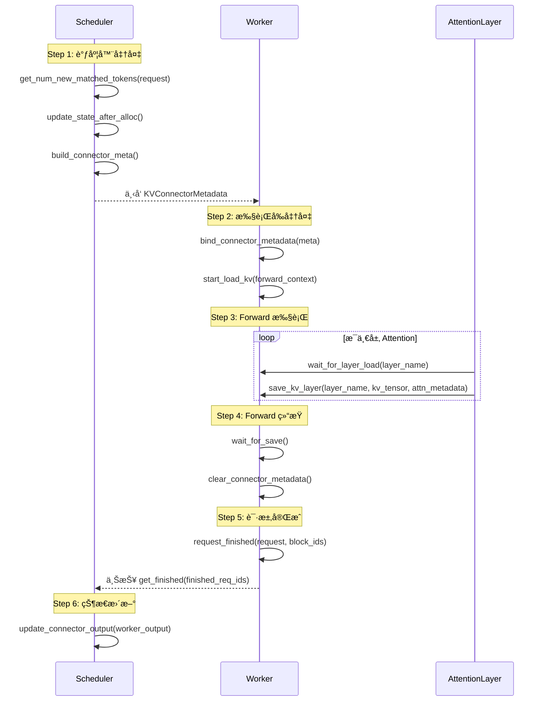

# å…³äºnixlçš„æ交记录/PD集æˆnvidia nixl
https://github.com/vllm-project/vllm/pull/17751

[P/D] NIXL Integration (#17751) d19110204c03e9b77ed957fc70c1262ff370f5e2


# 抽象基类 KVConnectorBase_V1
很好 ğŸ‘，你贴的这一段就是 **vLLM 中 KVConnector 的抽象基类æ¥å£å®šä¹‰**。
我帮你é€æ®µè§£é‡Šå®ƒçš„设计æ€è·¯å’Œå„个函数的作用。

---

## 🗠整体作用

`KVConnectorBase_V1` 作为 **KV 缓存传输的抽象基类**，分为 **两侧æ¥å£**：

* **Worker-side（模å‹æ‰§è¡ŒèŠ‚点）**
  负责和模å‹æ‰§è¡Œå¼ºç›¸å…³çš„事情：KV cache 的加载ã€ä¿å­˜ã€å¼‚步传输ã€ç­‰å¾…完æˆç­‰ã€‚
* **Scheduler-side（调度器节点）**
  负责和调度逻辑相关的事情：决定哪些 KV å¯ä»¥é‡ç”¨ã€ç”Ÿæˆ metadata，维护 KV 状æ€ã€‚

这样就把 **模å‹æ¨ç†æ‰§è¡Œ** å’Œ **分布å¼è°ƒåº¦** 解耦。

---

## 代ç è§£æ

### 1. åˆå§‹åŒ–

```python
def __init__(self, vllm_config: "VllmConfig", role: KVConnectorRole):
    logger.warning("... API is experimental ...")
    self._connector_metadata: Optional[KVConnectorMetadata] = None
    self._vllm_config = vllm_config
    self._role = role
```

* `vllm_config`：vLLM 的全局é…置（batching, kv layout 等）
* `role`：表æ˜æ˜¯ **worker 端** 还是 **scheduler 端**
* `_connector_metadata`：存放æ¯æ¬¡è°ƒåº¦æ—¶çš„ **KV 传输计划**（scheduler æ„建 → worker 使用）

---

### 2. Worker 端æ¥å£

#### 绑定/æ¸…ç† metadata

```python
def bind_connector_metadata(self, connector_metadata: KVConnectorMetadata): ...
def clear_connector_metadata(self): ...
def _get_connector_metadata(self) -> KVConnectorMetadata: ...
```

* 在æ¯æ¬¡æ¨¡å‹æ‰§è¡Œå‰ï¼Œscheduler ä¼šç”Ÿæˆ metadata，然å下å‘到 worker。
* worker 执行完一次 forward，就è¦æ¸…ç†ã€‚
* `_get_connector_metadata` åªå…许 connector 内部调用，ä¿è¯å®‰å…¨ã€‚

#### KV cache 注册和 host buffer 支æŒ

```python
def register_kv_caches(self, kv_caches: dict[str, torch.Tensor]): ...
def set_host_xfer_buffer_ops(self, copy_operation: CopyBlocksOp): ...
```

* `register_kv_caches`：预注册 KV ç¼“å­˜ï¼Œåƒ **NIXLConnector** è¿™ç§éœ€è¦é¢„åˆ†é… KV 缓冲时用。
* `set_host_xfer_buffer_ops`：如æœè¦ç»è¿‡ **host buffer 中转**（比如 GPU↔CPU↔RDMA），这里注册拷è´å‡½æ•°ã€‚

#### 关键抽象æ¥å£

```python
@abstractmethod
def start_load_kv(self, forward_context, **kwargs): ...
@abstractmethod
def wait_for_layer_load(self, layer_name): ...
@abstractmethod
def save_kv_layer(self, layer_name, kv_layer, attn_metadata, **kwargs): ...
@abstractmethod
def wait_for_save(self): ...
```

* **start\_load\_kv**：å¯åŠ¨å¼‚æ­¥ KV **加载**（外部 → 本地 paged buffer）
* **wait\_for\_layer\_load**：在æŸä¸€å±‚执行时，确ä¿è¯¥å±‚çš„ KV å·²ç»æ‹·è´å®Œï¼ˆlayer-by-layer pipeline）
* **save\_kv\_layer**：异步ä¿å­˜ä¸€å±‚ KV（本地 paged buffer → 外部存储/传输）
* **wait\_for\_save**：所有 KV ä¿å­˜å®Œæˆï¼Œæ‰èƒ½ç»“æŸ forward（é¿å… buffer 被覆盖）

👉 这里其å®å°±æ˜¯ **异步 KV IO API**，å…许æ¨ç†æ—¶è¾¹ç®—边传输。

#### 请求完æˆå›è°ƒ

```python
def get_finished(self, finished_req_ids: set[str]) -> tuple[Optional[set[str]], Optional[set[str]]]: ...
def request_finished(self, request, block_ids) -> tuple[bool, Optional[dict[str, Any]]]: ...
```

* `request_finished`：当一个请求æ¨ç†å®Œæ—¶è°ƒç”¨ï¼Œå¦‚æœ KV 还在 **异步ä¿å­˜/å‘é€**ï¼Œå°±è¿”å› `True`，延迟释放 buffer。
* `get_finished`：轮询哪些请求的 KV 异步传输已ç»å®Œæˆï¼Œå…许释放资æºã€‚

---

### 3. Scheduler 端æ¥å£

#### 计算å¯é‡ç”¨ token

```python
@abstractmethod
def get_num_new_matched_tokens(self, request, num_computed_tokens) -> tuple[int, bool]: ...
```

* 输入：该 request 本地已ç»ç®—çš„ token æ•°é‡
* 输出：还能ä»å¤–部 KV **ç›´æ¥å¤ç”¨**多少 token，是å¦éœ€è¦å¼‚步加载
  👉 å®ç° **prefix caching** 或跨 worker KV 共享时很é‡è¦ã€‚

#### 更新状æ€

```python
@abstractmethod
def update_state_after_alloc(self, request, blocks, num_external_tokens): ...
```

* 在 KV block 分é…å更新内部状æ€
* å¯èƒ½ä¼šè¢«è°ƒç”¨ä¸¤æ¬¡ï¼ˆä¸€æ¬¡é¢„分é…异步加载的 block，一次加载完æˆå分é…æ–° block）

#### æ„建 metadata

```python
@abstractmethod
def build_connector_meta(self, scheduler_output) -> KVConnectorMetadata: ...
```

* scheduler æ¯ä¸€æ­¥è¾“出å，调用该函数æ¥ç”Ÿæˆ **metadata**，然å下å‘ç»™ worker
* worker æ ¹æ®è¿™ä¸ª metadata 知é“哪些 KV è¦åŠ è½½ã€ä¿å­˜ã€ä¼ è¾“

#### 其他辅助函数

```python
def update_connector_output(self, connector_output): ...
@classmethod
def get_required_kvcache_layout(cls, vllm_config): ...
```

* `update_connector_output`：收集 worker 上报的执行结æœï¼Œæ›´æ–° scheduler 状æ€ã€‚
* `get_required_kvcache_layout`：指定 KV cache tensor çš„ layout（比如 `[head, seq, dim]` 或 `[seq, head, dim]`），有些 backend（比如 NCCL/NIXL）对 layout 有è¦æ±‚。

---

## 📠总结

`KVConnectorBase_V1` 定义了 **åˆ†å¸ƒå¼ KV cache 的抽象æ¥å£**，分为两大类：

* **Worker 端**：执行时的 KV cache 读写ã€å¼‚步加载/ä¿å­˜ã€å®Œæˆé€šçŸ¥
* **Scheduler 端**：调度时的 token 匹é…ã€block 分é…ã€metadata æ„建

它的设计核心是 **异步 + pipeline**：

* 在 **forward** 过程中边算边传 KV
* é¿å…计算和传输串行化，æ高并行度
* 支æŒä¸åŒ backend（local copy, RDMA, NIXL, DPU 等）统一æ¥å£

---

è¦ä¸è¦æˆ‘帮你画一个 **KVConnector 的调用时åºå›¾**（scheduler → worker → attention layer）？这样你能更直观地看到它是æ€ä¹ˆ orchestrate KV 的。


# 抽象基类调用时åºå›¾
好的 ✅ 我帮你画一个 **KVConnector 调用时åºå›¾**，展示 scheduler å’Œ worker 在一次 forward 中如何交互和传输 KV cache。

---

# 🔄 KVConnector 调用时åºå›¾



---

# 📠解释æµç¨‹

1. **Scheduler 端**

   * æ ¹æ®è¯·æ±‚å†å²ï¼Œè°ƒç”¨ `get_num_new_matched_tokens` 判断能å¤ç”¨å¤šå°‘ KV。
   * 调用 `update_state_after_alloc` 记录 KV block 分é…结æœã€‚
   * 调用 `build_connector_meta` ç”Ÿæˆ metadata，下å‘ç»™ worker。

2. **Worker 执行å‰**

   * 收到 metadata，调用 `bind_connector_metadata`。
   * 调用 `start_load_kv` 异步加载 KV 到 paged buffer。

3. **Forward 执行中（Attention 层）**

   * æ¯ä¸€å±‚执行å‰ï¼Œè°ƒç”¨ `wait_for_layer_load`，确ä¿è¯¥å±‚ KV å·²ç» ready。
   * æ¯ä¸€å±‚执行时，调用 `save_kv_layer` 异步ä¿å­˜è®¡ç®—好的 KV。

4. **Forward 结æŸ**

   * 调用 `wait_for_save` ç¡®ä¿ KV 都ä¿å­˜å®Œï¼Œé¿å… buffer 被覆盖。
   * 调用 `clear_connector_metadata` 清ç†ä¸Šä¸‹æ–‡ã€‚

5. **请求完æˆ**

   * 调用 `request_finished`，决定是å¦éœ€è¦å»¶è¿Ÿé‡Šæ”¾ block（异步传输还没完æˆï¼‰ã€‚
   * 调用 `get_finished` 查询已完æˆçš„请求，返å›ç»™ scheduler。

6. **Scheduler æ›´æ–°**

   * 调用 `update_connector_output`ï¼Œæ ¹æ® worker 上报的结æœæ›´æ–°çŠ¶æ€ã€‚

---

这个æµç¨‹å…¶å®å°±æ˜¯ **计算ä¸é€šä¿¡ overlap（é‡å ï¼‰** 的设计：

* KV **load** å¯ä»¥å’Œè®¡ç®—并行（å‰å±‚算，å层 KV 在传）。
* KV **save** å¯ä»¥å’Œè®¡ç®—并行（下一层算，上一层 KV 在传）。
* scheduler / worker çš„æ¥å£ä¸¥æ ¼åˆ†å¼€ï¼Œä¾¿äºæ”¯æŒå¤š backend。

---

è¦ä¸è¦æˆ‘å†å¸®ä½ ç”»ä¸€ä¸ª **并行时间线图（timeline）**，展示“计算 vs KV load/save vs 通信â€æ˜¯æ€ä¹ˆ overlap 的？


